# 🗄️ Database Schema

> **👤 USER-MAINTAINED DOCUMENT**  
> This document is maintained by the user. AI assistants should not modify this file.

This document defines the complete database schema for the HomeSearch application, including table structures, relationships, and naming conventions.

---

## Schema Overview

The database uses SQLite with a flat structure for the main `properties` table and separate configuration tables for dynamic scoring rules.

```mermaid
erDiagram
    properties {
        INTEGER id PK "Primary key, auto-increment"
        TEXT link "Funda listing URL"
        TEXT address_street "Street name"
        INTEGER address_house_number "House number"
        TEXT address_postal_code "Postal code"
        TEXT address_city "City name"
        INTEGER price_asking_price_eur "Asking price in EUR"
        INTEGER details_area_sqm "Total living area in m²"
        TEXT details_floor_info "Floor information (parterre, 1e, 2e, etc.)"
        INTEGER details_year_built "Year construction completed"
        TEXT details_energy_label "Energy label (A-G)"
        TEXT ownership_type "erfpacht or volle eigendom"
        TEXT ownership_lease_details "Lease conditions"
        TEXT ownership_perceel "Kadastral parcel reference"
        REAL vve_monthly_fee_eur "Monthly VVE fee in EUR"
        TEXT metadata_source "Data source (default: funda)"
        TEXT metadata_date_added "Date added to system"
        REAL main_bedroom_long_edge "Main bedroom long edge in m"
        REAL main_bedroom_short_edge "Main bedroom short edge in m"
        REAL guest_room_long_edge "Guest room long edge in m"
        REAL guest_room_short_edge "Guest room short edge in m"
        TEXT status "Property status (Interested, etc.)"
        TEXT comments "User comments"
        REAL main_bedroom_sqm "Main bedroom area in m²"
        TEXT kitchen_type "open, relocatable, closed"
        TEXT foundation_status "ok, unknown, concern"
        TEXT street_noise "quiet, medium, noisy"
        BOOLEAN smelly_business_below "Smelly business below"
        INTEGER commute_time_central_min "Commute to central in minutes"
        INTEGER commute_time_mark_min "Commute to Mark in minutes"
        INTEGER commute_time_sarah_min "Commute to Sarah in minutes"
        INTEGER workspace_count "Number of workspace areas"
        TEXT viewing_status "wishlist, scheduled, viewed, offer_made"
        TEXT notes "Additional notes"
        DATETIME created_at "Record creation timestamp"
        DATETIME updated_at "Record update timestamp"
    }

    scoring_rules {
        INTEGER id PK "Primary key, auto-increment"
        TEXT key UK "Rule key (unique)"
        TEXT category "Rule category (Sizing, Area, Access, Financials, Layout)"
        TEXT type "Rule type (dealbreaker, threshold, banded, enum)"
        REAL default_threshold "Optional threshold value"
        INTEGER default_points "Points if threshold met (non-banded)"
        REAL weight "Weight multiplier (default 1.0)"
        BOOLEAN is_dealbreaker "If true, failing the rule = auto fail"
        TEXT description "Human-readable description"
        DATETIME created_at "Record creation timestamp"
        DATETIME updated_at "Record update timestamp"
    }

    scoring_bands {
        INTEGER id PK "Primary key, auto-increment"
        INTEGER rule_id FK "References scoring_rules(id)"
        REAL min_value "Minimum value for this band"
        REAL max_value "Maximum value (null for open-ended)"
        INTEGER points "Points awarded for this range"
        DATETIME created_at "Record creation timestamp"
    }

    scoring_enums {
        INTEGER id PK "Primary key, auto-increment"
        INTEGER rule_id FK "References scoring_rules(id)"
        TEXT option "Enum option value"
        INTEGER points "Points awarded for this option"
        BOOLEAN is_dealbreaker "Whether this option is a dealbreaker"
        DATETIME created_at "Record creation timestamp"
    }

    migrations {
        INTEGER id PK "Primary key, auto-increment"
        TEXT version UK "Migration version (unique)"
        DATETIME applied_at "When migration was applied"
    }

    scoring_rules ||--o{ scoring_bands : "has bands"
    scoring_rules ||--o{ scoring_enums : "has options"
```

---

## Table Details

### `properties` (Main Table)
The central table storing all property information, both scraped from Funda and manually entered by users.

**Key Groups:**
- **Address**: `address_street`, `address_house_number`, `address_postal_code`, `address_city`
- **Price**: `price_asking_price_eur`
- **Details**: `details_area_sqm`, `details_floor_info`, `details_year_built`, `details_energy_label`
- **Ownership**: `ownership_type`, `ownership_lease_details`, `ownership_perceel`
- **VVE**: `vve_monthly_fee_eur`
- **Metadata**: `metadata_source`, `metadata_date_added`
- **Room Dimensions**: `main_bedroom_long_edge`, `main_bedroom_short_edge`, `guest_room_long_edge`, `guest_room_short_edge`
- **Scoring Inputs**: `main_bedroom_sqm`, `kitchen_type`, `foundation_status`, `street_noise`, `smelly_business_below`, `commute_time_central_min`, `commute_time_mark_min`, `commute_time_sarah_min`, `workspace_count`, `viewing_status`, `notes`

### `scoring_rules` (Main Rules Configuration)
Stores all scoring rules with their configuration parameters.

**Rule Categories:**
- **Sizing**: Rules about room/property dimensions
- **Area**: Rules about total living area
- **Access**: Rules about accessibility (floors, etc.)
- **Financials**: Rules about budget and pricing
- **Layout**: Rules about property layout and features

**Rule Types:**
- **threshold**: Simple pass/fail based on a threshold value
- **banded**: Point ranges based on value bands
- **enum**: Points based on categorical options
- **dealbreaker**: Simple pass/fail that disqualifies if failed

**Example Rules:**
- `bedroom_min_sqm`: Sizing, threshold, 8.0 m² minimum, dealbreaker
- `total_area_min_sqm`: Area, banded, 77.0 m² minimum, dealbreaker
- `floor_max_entrance`: Access, threshold, 2nd floor maximum, dealbreaker
- `budget_max_price`: Financials, banded, no threshold, not dealbreaker
- `kitchen_layout`: Layout, enum, no threshold, not dealbreaker

### `scoring_bands` (Banded Rule Values)
Defines point ranges for banded rules (referenced by `rule_id`).

**Example Bands for `total_area_min_sqm`:**
- 77-79 m² → 5 points
- 80-85 m² → 7 points
- 86-90 m² → 9 points
- 91+ m² → 10 points

**Example Bands for `budget_max_price`:**
- ≤ €750k → 10 points
- €751k-€790k → 5 points
- €791k+ → -5 points

### `scoring_enums` (Enum Rule Options)
Defines options and points for enum-based rules (referenced by `rule_id`).

**Example Options for `kitchen_layout`:**
- `open` → 10 points, not a dealbreaker
- `relocatable` → 5 points, not a dealbreaker
- `closed` → 0 points, is a dealbreaker

### `migrations` (Migration Tracking)
Tracks which database migrations have been applied.

---

## Naming Conventions

### Table Names
- **Format**: `snake_case`
- **Examples**: `properties`, `scoring_config`, `scoring_bands_total_area`

### Column Names
- **Format**: `snake_case` with logical prefixes
- **Prefixes**:
  - `address_*` for address fields
  - `price_*` for price fields
  - `details_*` for property details
  - `ownership_*` for ownership information
  - `vve_*` for VVE (homeowners association) data
  - `metadata_*` for metadata
  - `scoring_*` for scoring configuration tables

### Data Types
- **INTEGER**: Whole numbers (IDs, prices, counts, years)
- **REAL**: Decimal numbers (areas, fees, weights)
- **TEXT**: Strings (names, descriptions, statuses)
- **BOOLEAN**: True/false values (0/1 in SQLite)
- **DATETIME**: Timestamps (ISO format)

---

## Relationships

The database uses a **hybrid structure** with both flat and relational elements:

- **properties** is the main entity table (flat structure)
- **scoring_rules** is the central rules configuration table
- **scoring_bands** and **scoring_enums** are related to scoring_rules via foreign keys
- **migrations** tracks schema changes

**Foreign Key Relationships:**
- `scoring_bands.rule_id` → `scoring_rules.id` (CASCADE DELETE)
- `scoring_enums.rule_id` → `scoring_rules.id` (CASCADE DELETE)

**Application-Level Relationships:**
- Properties are scored against rules through the scoring service
- Rule keys map to property field paths (e.g., `bedroom_min_sqm` → `property.scoring.main_bedroom_sqm`)

---

## Indexes

SQLite automatically creates indexes for:
- Primary keys (`id` columns)
- Unique constraints (`key` in `scoring_config`, `kitchen_type` in `scoring_kitchen_points`)

No additional indexes are explicitly defined in the current schema.

---

## Migration History

1. **001_initial_schema**: Creates basic `properties` table
2. **002_add_scoring_fields**: Adds scoring input fields to `properties`
3. **003_add_scoring_config_tables**: Creates legacy scoring configuration tables
4. **004_seed_scoring_config**: Seeds default configuration values
5. **005_add_missing_commute_fields**: Adds missing commute time fields
6. **006_generic_scoring_system**: Creates new generic scoring tables (`scoring_rules`, `scoring_bands`, `scoring_enums`)
7. **007_migrate_existing_scoring_data**: Migrates existing configuration to new generic structure
